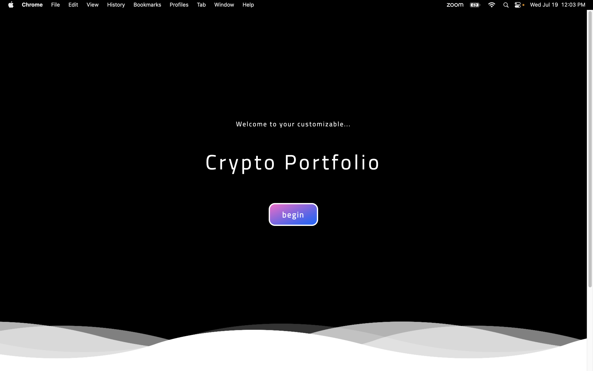
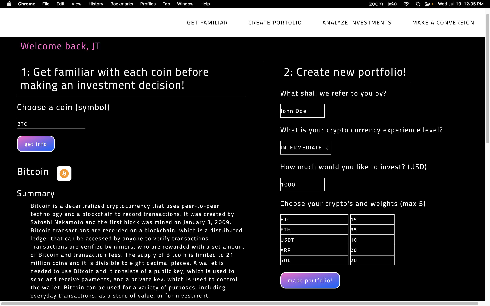
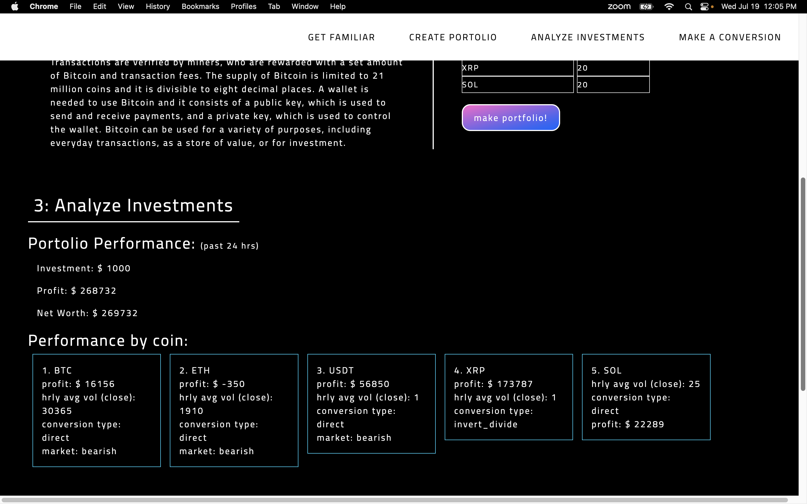
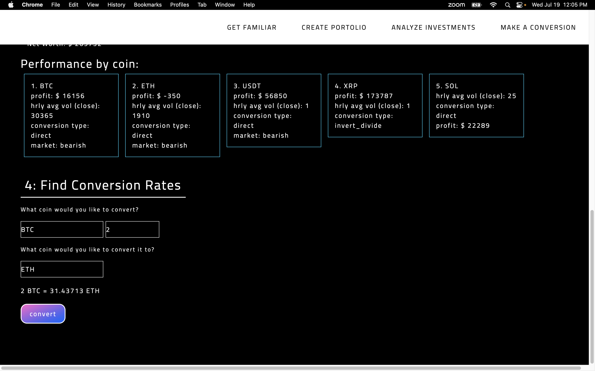

# Crypto Dashboard

## Description

<<<<<<< HEAD
=======
[Visit the Deployed Site](https://ailllycxr.github.io/cryptoDashboard/)

>>>>>>> 015f1f33b882f670a7f4bd44a137b256457e7f10
Crypto Dashboard is a web application that provides real-time information and analysis for various cryptocurrencies. It offers features such as displaying the current price of cryptocurrencies, calculating profit based on investment and percentage allocations, showing market sentiment and trading volume, and providing historical data and conversion types. The application aims to help users make informed decisions and track the performance of their cryptocurrency investments.

The user interface is designed with a clean and modern layout, making it easy to navigate and understand the information presented. The site incorporates responsive design principles, ensuring a seamless experience across different devices and screen sizes.

Overall, Crypto Dashboard is a valuable tool for cryptocurrency enthusiasts and investors who want to stay updated with the latest market trends and make data-driven decisions.

## Technologies
<<<<<<< HEAD
=======

| Technology Used         | Resource URL           | 
| ------------- |:-------------:| 
| HTML    | [https://developer.mozilla.org/en-US/docs/Web/HTML](https://developer.mozilla.org/en-US/docs/Web/HTML) | 
| CSS     | [https://developer.mozilla.org/en-US/docs/Web/CSS](https://developer.mozilla.org/en-US/docs/Web/CSS)      |   
| Git | [https://git-scm.com/](https://git-scm.com/)     |  
| Javascript | [https://developer.mozilla.org/en-US/docs/Web/JavaScript](https://developer.mozilla.org/en-US/docs/Web/JavaScript) |
| JQuery | [https://api.jquery.com/category/attributes/](https://api.jquery.com/category/attributes/)
| BootStrap    | [https://getbootstrap.com/docs/5.3/getting-started/introduction/](https://getbootstrap.com/docs/5.3/getting-started/introduction/) |
| UIKit    | [https://getuikit.com/docs/introduction](https://getuikit.com/docs/introduction) |
| CryptoCompare API    | [https://min-api.cryptocompare.com/documentation](https://min-api.cryptocompare.com/documentation) |
| CoinLayer API    | [https://coinlayer.com/documentation](https://coinlayer.com/documentation) |
>>>>>>> 015f1f33b882f670a7f4bd44a137b256457e7f10

| Technology Used   |                                                            Resource URL                                                            |
| ----------------- | :--------------------------------------------------------------------------------------------------------------------------------: |
| HTML              |               [https://developer.mozilla.org/en-US/docs/Web/HTML](https://developer.mozilla.org/en-US/docs/Web/HTML)               |
| CSS               |                [https://developer.mozilla.org/en-US/docs/Web/CSS](https://developer.mozilla.org/en-US/docs/Web/CSS)                |
| Git               |                                            [https://git-scm.com/](https://git-scm.com/)                                            |
| Javascript        |         [https://developer.mozilla.org/en-US/docs/Web/JavaScript](https://developer.mozilla.org/en-US/docs/Web/JavaScript)         |
| JQuery            |                     [https://api.jquery.com/category/attributes/](https://api.jquery.com/category/attributes/)                     |
| BootStrap         | [https://getbootstrap.com/docs/5.3/getting-started/introduction/](https://getbootstrap.com/docs/5.3/getting-started/introduction/) |
| UIKit             |                          [https://getuikit.com/docs/introduction](https://getuikit.com/docs/introduction)                          |
| CryptoCompare API |                 [https://min-api.cryptocompare.com/documentation](https://min-api.cryptocompare.com/documentation)                 |
| CoinLayer API     |                             [https://coinlayer.com/documentation](https://coinlayer.com/documentation)                             |

## Code Refactor Example

```HTML
   <div id="visDivFour" class="uk-animation-slide-right-medium">
                  <h5 class="uk-margin-bottom">Choose your crypto's and weights (max 5)</h5>
                  <input id="coin1" class="uk-input uk-form-width-medium uk-form-small" type="text" placeholder="ie: BTC" aria-label="Small">
                  <input value="0" id="percent1" class="uk-input uk-form-width-small uk-form-small" type="number" placeholder="5 (%)" aria-label="Small">
                  <br>
                  <input id="coin2" class="uk-input uk-form-width-medium uk-form-small" type="text" placeholder="ie: ETH" aria-label="Small">
                  <input value="0" id="percent2" class="uk-input uk-form-width-small uk-form-small" type="number" placeholder="10 (%)" aria-label="Small">
                  <br>
                  <input id="coin3" class="uk-input uk-form-width-medium uk-form-small" type="text" placeholder="ie: USDT" aria-label="Small">
                  <input value="0" id="percent3" class="uk-input uk-form-width-small uk-form-small" type="number" placeholder="20 (%)" aria-label="Small">
                  <br>
                  <input id="coin4" class="uk-input uk-form-width-medium uk-form-small" type="text" placeholder="ie: XRP" aria-label="Small">
                  <input value="0" id="percent4" class="uk-input uk-form-width-small uk-form-small" type="number" placeholder="30 (%)" aria-label="Small">
                  <br>
                  <input id="coin5" class="uk-input uk-form-width-medium uk-form-small" type="text" placeholder="ie: SOL" aria-label="Small">
                  <input value="0" id="percent5" class="uk-input uk-form-width-small uk-form-small" type="number" placeholder="35 (%)" aria-label="Small">
                  <br>
                  <div class=" uk-margin-top">
                      <button class="submit-button">make portfolio!</button>
                  </div>
              </div>
```

```CSS
*{
    margin: 0 !important;
    padding: 0 !important;
    font-family: 'Titillium Web', sans-serif !important;
    letter-spacing: 2px !important;
    color: white !important;
    background-color: black !important;
}
input{
    background-color: black !important;
}
html{
    color: black !important;
}
h1, h2{
    color: white !important;
    padding: 10px !important;
    border-bottom: 2px solid white;
    display: table !important;
}
#surveyForm{
    width: 100% !important;
}
#survey{
    width: 80% !important;
    padding-left: 50px !important;
    border-left: 2px solid white;
}

```

```Java
function getSocialSentiment(coinList){
    var index=0
    for (var i=0;i<coinList.length;i++){
        var coinName= coinList[i]
        var requestUrl="https://min-api.cryptocompare.com/data/tradingsignals/intotheblock/latest?fsym="+coinName+"&api_key=4643002f15269f3fab2e433e581986eb8e0d2eb7711e7b78e90fb547713396df";
        fetch(requestUrl)
            .then(function(response){
                if (!response.ok){
                    showError();
                }else{
                    return response.json();
                }
            })
            .then(function(responseData){
            var sentiment = responseData.Data.addressesNetGrowth.sentiment;
            var paragraph = $(".crypto"+index);
            var pTag=$("<p>")
            pTag.addClass("p1")
            pTag.text("market: "+sentiment)
            paragraph.append(pTag)
            index++
            })
        }
    }

```

## Usage 

### The screenshots below demonstrate the application's functionality.



### - Our Welcome Page displays the App Name as well as a welcome message and a begin button.
### - It also features a moving cloud animation at the bottom of the browser.



### - Upon pressing begin, the user is taken to the main page.
### - On this page, the user can read a descriptive summary on coins of their choice.
### - They then can use their knowledge to create a custom portfolio.



### - After completing the survey, a custom portfolio is generated.
### - Here the user can view the overall performance on their portfolio as
### well as view the performace and metrics of each coin they invested in
### - The amount and depth of information displayed for each coin is
### generated according to the experience level indicated by the user.



### - The user also has the ability to find conversion rates between two coins by
### entering one coin name with the amount to convert and a second to convert to


# Author Info


### Jordan Lopez

- [LinkedIn](https://www.linkedin.com/in/jordanlopez123/)
- [Github](https://github.com/Lopez-Jordan)

### Xiaoran Cai

- [LinkedIn](https://www.linkedin.com/in/xrcai/)
- [Github](https://github.com/Ailllycxr)

### Jesus Thomas Reyes

- [LinkedIn](https://www.linkedin.com/in/jesus-thomas-reyes-aa001a192/)
- [Github](https://github.com/jesustgr)

## Credits

- W3school| [https://www.w3schools.com](https://www.w3schools.com)

## License

Copyright (c). All rights reserved.
Licensed under the [MIT](https://choosealicense.com/licenses/mit/) license.

## Features

The nevigation bar items link to their content repectively
